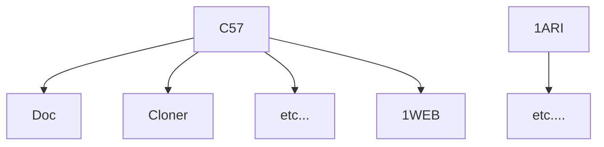

Déb.:

100% - 1/9
0% - 2/9
https://www.supinfo.com/cours/1CPA/chapitres/01-codage-binaires

 
20%
https://www.supinfo.com/cours/1ADS/chapitres/01-premiers-pas

0%
https://www.supinfo.com/cours/1CPA/chapitres/02-autres-codages-numeriques

10%
https://www.supinfo.com/cours/1SET/chapitres/ 

But: 
40%
https://www.supinfo.com/cours/2ADS/chapitres/05-programmation-dynamique

Liste complète des cours:
https://www.supinfo.com/cours/

// 2do Faire arbo des chemins d'apprentissage

